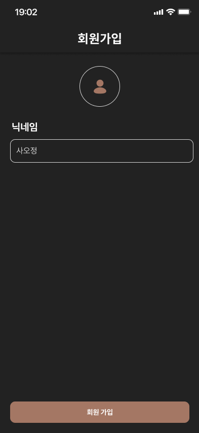
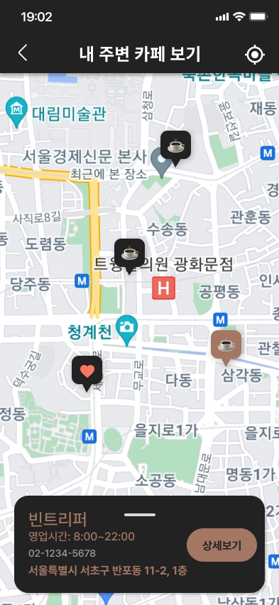
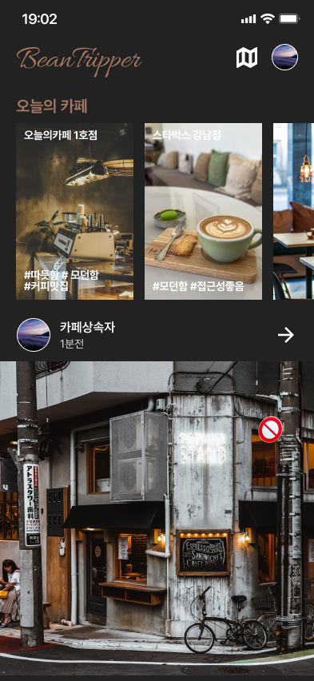
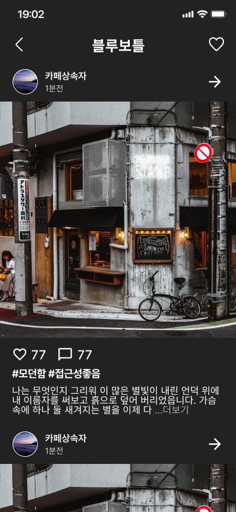
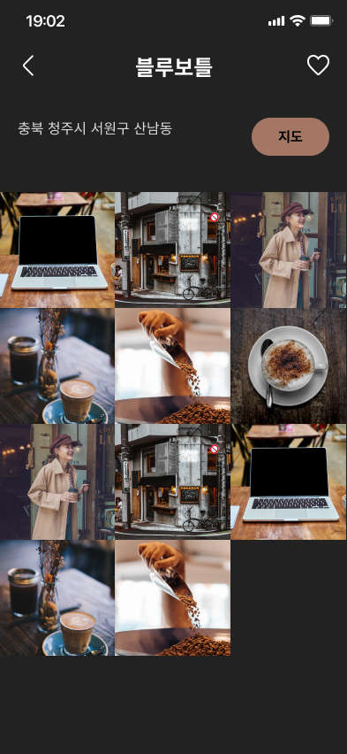
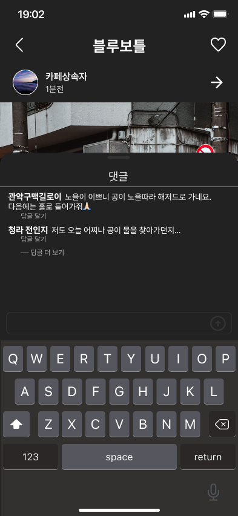
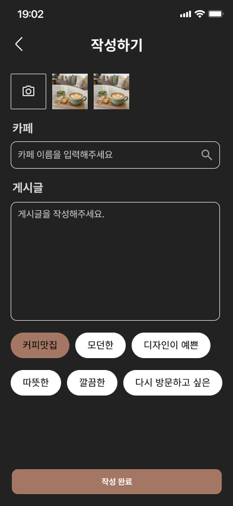

<p align="center">

</p>

# ☕️ 카페 추천 SNS

Flutter 기반으로 제작된 **지도 연동 카페 추천 SNS**입니다. 사용자는 **피드 및 댓글 작성**을 하고 위치 기반으로 카페를 추천 받을 수 있습니다.

---

## 🖥️ 시연 영상 링크

## https://www.youtube.com/

## 🚀 주요 기능

1. **구글&카카오(sns) 로그인 기능**

   - 아이디와 이메일 입력 없이 간편히 로그인 가능합니다.

2. **지도 연동 기능**

   - **네이버 지도 API**를 사용해 **GPS**기반으로 주변에 등록된 카페를 탐색할 수 있습니다.

3. **피드 및 댓글 작성 기능**

   - 카페에 대해 피드를 작성 할 수 있습니다.
   - 피드에 대해 댓글을 작성 할 수 있습니다.

4. **피드 및 댓글 조회 기능**
   - 카페에 대해 피드를 조회 할 수 있습니다.
   - 피드에 대해 댓글을 조회 할 수 있습니다.

---

## 📊 데이터 관리

1. **Firebase를 이용한 데이터 관리**

   - 데이터를 **JSON 파일** 형식으로 로드 및 저장합니다.
   - 앱 상태에서 데이터를 등록하고 사용할 수 있도록 구조화했습니다.

2. **데이터 흐름**

   - Firebase와 연동하여 사용자 정보와 피드 와 댓글의 데이터를 처리합니다.

3. **데이터 종류**

### user 데이터

```
name(문자열)
"댕댕이"

profile(문자열)
"https://k.kakaocdn.net/dn/bJqZ5K/btsIThSBJBo/I37LJ9OZbgn4tPkBKsd6G1/img_110x110.jpg"
```

### cafe데이터

```
address(문자열)
"서울특별시 마포구 성산동 208-13 (성산동)"

lat(문자열)
"375611839"

lng(문자열)
"1269163252"

name(문자열)
"PITC"
```

### feed데이터

```
cafeName(문자열)
"블루체어라운지"

categories(배열)
[0](문자열)
"모던한"

[1](문자열)
"따듯한"

content(문자열)
"블루체어라운지 유명하다고해서 왔어요! 주차공간도 넓고 카페도 엄청 크고 커피도 맛있습니다. 2층은 카페뿐만아니라 음식도 팔아서 브런치나 밥 먹으러 오기도 좋아요!! 날씨 좋을 때는 옥탑에서 저녁먹으면서 노을을 보는 뷰도 환상적입니다."

createdAt(타임스탬프)
2025년 1월 9일 오후 9시 58분 14초 UTC+9

imageUrls(배열)
[0](문자열)
"https://firebasestorage.googleapis.com/v0/b/beantripper-7578b.firebasestorage.app/o/uploads%2Fimage_picker_A68B07F2-62AF-4307-8579-779A3B8A44E4-43128-0000002A644B530A.jpg?alt=media&token=1a2b3029-79fb-4c86-babb-37198f4be4a7"
```

### comment데이터

```
comment(문자열)
""

postId(문자열)
"C76ntLL7Y2KxVi85XKln"

timestamp(타임스탬프)
2025년 1월 9일 오후 9시 17분 23초 UTC+9
```

---

## 🧩 기능별 상세 페이지

### 1. **로그인 페이지** (`login_page`) 및 **회원가입 페이지** (`register_page`)

 <p align="left">
   
   
   </p>
   
- **SNS(구글,카카오) 로그인**을 통해 ID 및 비밀번호 없이 간편 로그인 가능합니다.
- **구글, 카카오 계정 정보**에서 프로필 이미지와 닉네임 기본값을 가져오며, 사용자 설정에 따라 수정 가능합니다.
- **자동 로그인**을 통해 기존에 로그인 했다면 메인페이지로 이동합니다.

### 2. **지도 페이지** (`map_page`)

<p align="left">

</p>

- **네이버 지도 API**를 이용해 내 주변 카페 확인.
- 하단 **위치 버튼** 클릭 현재 자신의 위치를 기준으로 카페를 보여줍니다.
- **채팅방 마커** 선택 시 카페 상세 정보(이름, 영업시간, 전화번호, 주소) 확인 가능합니다.

### 3. **피드 페이지** (`feeds_page`) 및 **피드 상세 페이지** (`feed_detail_page`)

<p align="left">


</p>

- 피드의 대표 사진, 내용, 좋아요수, 댓글수, 테마를 확인할 수 있습니다.
- 피드의 상세내용(전체 사진, 댓글, 테마)을 확인가능합니다.

### 4. **카페 상세 페이지(`cafe_detail_page`)** 및 카페 피드 페이지(`cafe_feed_page`)

<p align="left">


</p>

- 주소와 카페에 달린 피드를 확인할 수 있습니다.

### 5. **피드 작성 페이지(`write_page`)**

<p align="left">

</p>

- 피드에 사진, 카페이름, 게시글, 테마를 작성합니다.
- 카페이름은 **네이버 검색api**와 연동되어 편리하게 검색 가능합니다.

## 🛠️ 기술 스택

- **Framework**: Flutter
- **Language**: Dart
- **State Management**: Riverpod
- **Data Handling**: Firebase

### UI Components

- **AnimatedBuilder**: `LinearGradient` 애니메이션 처리
- **flutter_naver_map**: 네이버 지도 API 연동
- **GridView.builder**: 무한 스크롤 처리

### 입력값 검증 및 환경 변수 관리

- **Validation**: `snackbar`를 통해 사용자 입력값 검증
- **DotEnv**: GitHub 업로드 시 API Key 등의 민감한 정보 보호

## 📁 **프로젝트 구조**

```
📦lib
┣ 📂constant
┃ ┗ 📜theme.dart
┣ 📂core
┃ ┣ 📂widgets
┃ ┃ ┣ 📜feed_content.dart
┃ ┃ ┗ 📜feed_info.dart
┃ ┣ 📜comment_page.dart
┃ ┣ 📜feed_categories.dart
┃ ┣ 📜feed_detail_page.dart
┃ ┗ 📜geolocator_helper.dart
┣ 📂data
┃ ┣ 📂data_source
┃ ┃ ┣ 📜app_user_data_source.dart
┃ ┃ ┣ 📜app_user_data_source_impl.dart
┃ ┃ ┣ 📜cafe_data_source.dart
┃ ┃ ┣ 📜cafe_data_source_impl.dart
┃ ┃ ┣ 📜feed_data_source.dart
┃ ┃ ┗ 📜feed_data_source_impl.dart
┃ ┣ 📂dto
┃ ┃ ┣ 📜cafe_detail_dto.dart
┃ ┃ ┣ 📜cafe_marker_dto.dart
┃ ┃ ┣ 📜cafe_selection_dto.dart
┃ ┃ ┣ 📜comment_dto.dart
┃ ┃ ┣ 📜feed_dto.dart
┃ ┃ ┗ 📜user_dto.dart
┃ ┗ 📂repository
┃ ┃ ┣ 📜app_user_repository_impl.dart
┃ ┃ ┣ 📜cafe_repository_impl.dart
┃ ┃ ┣ 📜comment_repository.dart
┃ ┃ ┗ 📜feed_repository_impl.dart
┣ 📂domain
┃ ┣ 📂entity
┃ ┃ ┣ 📜app_user.dart
┃ ┃ ┣ 📜cafe_detail.dart
┃ ┃ ┣ 📜cafe_marker.dart
┃ ┃ ┣ 📜comment.dart
┃ ┃ ┗ 📜feed.dart
┃ ┣ 📂repository
┃ ┃ ┣ 📜app_user_repository.dart
┃ ┃ ┣ 📜cafe_repository.dart
┃ ┃ ┗ 📜feed_repository.dart
┃ ┗ 📂usecase
┃ ┃ ┣ 📜fetch_cafe_item_usecase.dart
┃ ┃ ┣ 📜fetch_cafes_list_usecase.dart
┃ ┃ ┣ 📜fetch_user_usecase.dart
┃ ┃ ┣ 📜save_user_usecase.dart
┃ ┃ ┣ 📜sign_in_with_google_usecase.dart
┃ ┃ ┗ 📜update_user_usecase.dart
┣ 📂presentation
┃ ┣ 📂pages
┃ ┃ ┣ 📂cafe_detail
┃ ┃ ┃ ┣ 📂widgets
┃ ┃ ┃ ┃ ┣ 📜cafe_feed_collection.dart
┃ ┃ ┃ ┃ ┗ 📜cafe_info.dart
┃ ┃ ┃ ┣ 📜cafe_detail_page.dart
┃ ┃ ┃ ┗ 📜cafe_detail_view_model.dart
┃ ┃ ┣ 📂cafe_selection
┃ ┃ ┃ ┣ 📜cafe_selection_page.dart
┃ ┃ ┃ ┗ 📜cafe_selection_viewmodel.dart
┃ ┃ ┣ 📂feed_write
┃ ┃ ┃ ┣ 📂widgets
┃ ┃ ┃ ┃ ┣ 📜image_picker_section.dart
┃ ┃ ┃ ┃ ┣ 📜submit_button.dart
┃ ┃ ┃ ┃ ┣ 📜tag_selection_section.dart
┃ ┃ ┃ ┃ ┗ 📜text_input_section.dart
┃ ┃ ┃ ┣ 📜feed_wirte_viewmodel.dart
┃ ┃ ┃ ┗ 📜feed_write_page.dart
┃ ┃ ┣ 📂feeds
┃ ┃ ┃ ┣ 📜cafe_of_the_day.dart
┃ ┃ ┃ ┣ 📜feeds_page.dart
┃ ┃ ┃ ┗ 📜feeds_page_viewmodel.dart
┃ ┃ ┣ 📂home
┃ ┃ ┃ ┣ 📂widgets
┃ ┃ ┃ ┃ ┗ 📜home_bottom_navigation_bar.dart
┃ ┃ ┃ ┣ 📜home_page.dart
┃ ┃ ┃ ┗ 📜home_view_model.dart
┃ ┃ ┣ 📂login
┃ ┃ ┃ ┣ 📂widget
┃ ┃ ┃ ┃ ┣ 📜custom_social_button.dart
┃ ┃ ┃ ┃ ┗ 📜looking_around_button.dart
┃ ┃ ┃ ┣ 📜login_page.dart
┃ ┃ ┃ ┗ 📜register_page.dart
┃ ┃ ┣ 📂map
┃ ┃ ┃ ┣ 📂widgets
┃ ┃ ┃ ┃ ┣ 📜cafe_info_bottom_sheet.dart
┃ ┃ ┃ ┃ ┗ 📜map_widget.dart
┃ ┃ ┃ ┣ 📜map_page.dart
┃ ┃ ┃ ┗ 📜map_view_model.dart
┃ ┃ ┣ 📂profile
┃ ┃ ┃ ┗ 📜profile_page.dart
┃ ┃ ┗ 📂splash
┃ ┃ ┃ ┗ 📜splash_page.dart
┃ ┣ 📂view_model
┃ ┃ ┗ 📜auth_view_model.dart
┃ ┣ 📂widgets
┃ ┃ ┗ 📜file
┃ ┗ 📜provider.dart
┣ 📜firebase_options.dart
┗ 📜main.dart
```

## 📍 **설치 및 실행**

### 1. **Flutter 설치**

Flutter가 설치되어 있지 않다면 [Flutter 설치 가이드](https://docs.flutter.dev/get-started/install)를 참고하세요.

- **프로젝트 클론**

```
git clone git@github.com:BeanTripper/beantripper.git
cd beantripper
```

- **의존성 설치**

```
flutter pub get
```

## 🏂 **향후 개선 방향**

### 1. **기획 구체화**

- 데이터 구조 및 기능 사전 기획 구체화하여 혼선을 최소화하기

### 2. **카페 추천 서비스**

- AI를 기반으로 선호가 예측되는 카페 추천

## 📅 **개발 기간**

- 2025.01.03(금) ~ 2025.01.13(월)

## 👦 **개발 인원**

- 김고은: https://github.com/dolbuda13
- 이현주: https://github.com/LeeHJu
- 김진용: https://github.com/1125bid
- 목진성: https://github.com/JinseongMOK
- 박채은: https://github.com/ParkChaeEun08
